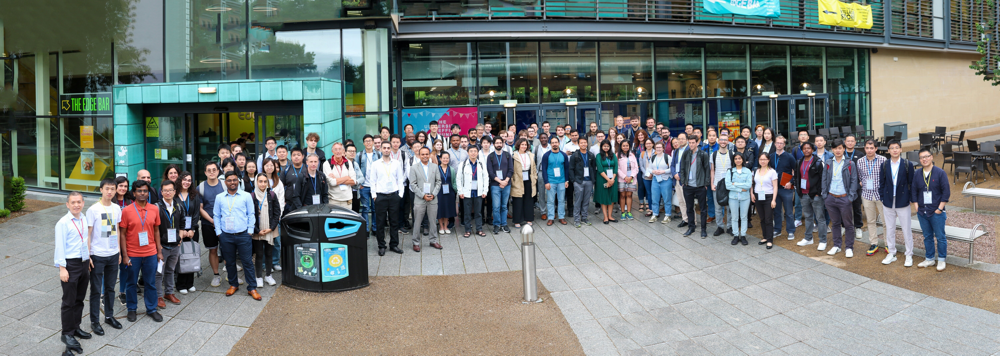

---
# A Demo section created with the Blank widget.
# Any elements can be added in the body: https://wowchemy.com/docs/writing-markdown-latex/
# Add more sections by duplicating this file and customizing to your requirements.
widget: blank
headless: true # This file represents a page section.

weight: 10 # Order that this section will appear.
title: First Workshop on Multimodal AI
hero_media: 
design:
  # Choose how many columns the section has. Valid values: 1 or 2.
  columns: '1'
  # Add custom styles
  css_style:
  css_class:
---

- [Imagine Multimodal](https://medium.com/@haipinglu/imagine-multimodal-ai-7eb4ef47f2ab) AI (Insights from the First Workshop on Multimodal AI)
- [MultimodalAI'23 Photos](https://drive.google.com/drive/u/1/folders/1Mm3spa4EVAKJCJnoJpizEaP7MiP71o4Q)
- [MultimodalAI'23 Keynote Speakers YouTube Videos](https://www.youtube.com/@ShefCMI/playlists)
- [MultimodalAI'23 pitches slides and posters](https://drive.google.com/drive/u/1/folders/1lKE-QLKiSYqIft8GixFe-vITzjIYYn4p)

MultimodalAI'23 Photos Now Available! Click the photo to view and download!

**Join the Multimodal AI Community mailing list by [subscribing to our Google Group](https://groups.google.com/a/sheffield.ac.uk/g/multimodal-ai-community-group).**

