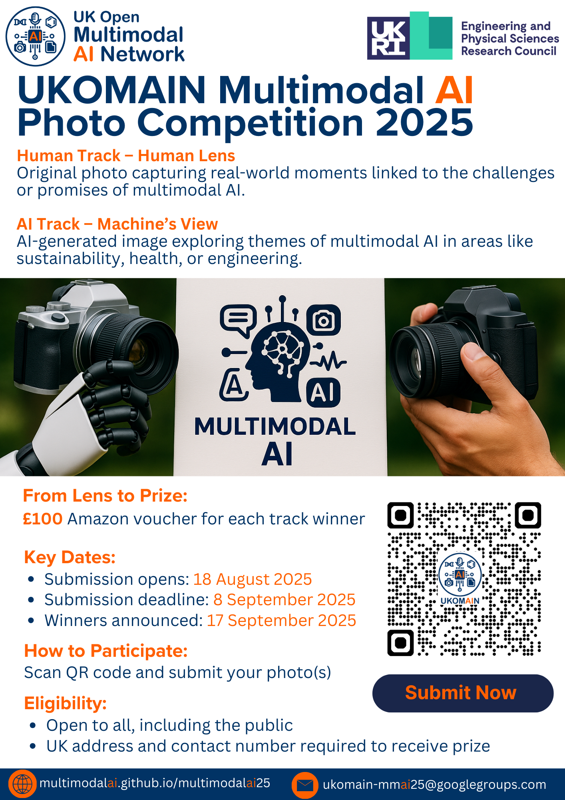

### 📸 Call for Entries: UKOMAIN Multimodal AI Photo Competition 2025

Are you ready to show the world what Multimodal AI “sees” — or what you see through your own lens?

As part of UKOMAIN’s mission to foster creative, inclusive, and community-driven engagement, we’re excited to launch the first UKOMAIN Multimodal AI Photo Competition — featuring two exciting tracks:

- #### AI Track – "Through the Eyes of the Machine"
Submit an AI-generated image that creatively explores themes of multimodal AI — such as engineering, sustainability, wellbeing, or other areas where diverse data and intelligent systems shape our world.

- #### Human Track – "The Human Lens"
Submit a photo you’ve taken that captures a real-world moment reflecting the challenges or promises of multimodal AI in our lives, communities, or environment.

**Eligibility**: If you are selected as a winner, you will need to provide a UK postal address for prize delivery and a UK contact number in case of delivery issues. Prizes will be delivered via Royal Mail registered postal service. We only request postal and contact details **after selection** and will use them solely for prize delivery. All personal data will be deleted after delivery is complete. 

**Note**: We define Multimodal AI broadly as the integration of any two or more types of data, not limited to texts and images. An individual may submit one image per track (maximum two images in total).

---

### 🏆 Prizes

- **Two winners** (one from each track)
  -  **£100 Amazon voucher**

---

### 📅 Key Dates

- **Submission Opens**: 18 August 2025
- **Submission Deadline**: 8 September 2025
- **Voting Opens**: 9 September 2025
- **Voting Closes**: 16 September 2025 (5 PM)
- **Winners Announced**: 17 September 2025

---

### 📥 How to Enter

- Submit your image (_file size not more than 10 MB_) via [submission form](https://forms.gle/c5ggm9w8w4dMevj16)

- Include:
  - Title and brief description (max 50 words)
  - Indicate whether it's AI-generated or human-taken
  - Your name and affiliation (optional for public posting)

---

This competition celebrates creativity and multimodal perspectives — with AI or without. It’s about showcasing how technology and humanity can view and shape our world together.

### 📄 Copyright and Permission Statement

By submitting your image(s), you confirm that:

- You own the copyright or have the right to submit them. For AI-generated images, you used tools in a way that gives you the right to submit and share the content.
- You grant UKOMAIN a **non-exclusive**, **royalty-free**, **worldwide licence** for **non-commercial use** (including showcasing, promoting, and archiving) for an unlimited period. Copyright remains with you.
- They are legal, respectful, and comply with copyright, privacy, and consent laws. You accept **full responsibility** for the content and legality of your submission(s).

**[Submit now](https://forms.gle/c5ggm9w8w4dMevj16) and be part of the UKOMAIN visual story.**

